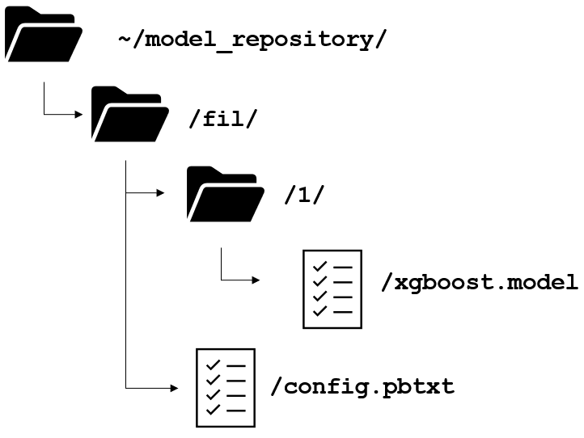

# Triton Server

### Install the Triton Server Container:
`docker pull nvcr.io/nvidia/tritonserver:22.01-py3`

### Install the Triton Server Client
`pip3 install tritonclient`\
  or\
`pip3 install tritonclient[http]`\
  or\
`docker pull nvcr.io/nvidia/tritonserver:22.01-py3-sdk`\

## Using Triton
Before Triton can be used, it requires that the model be saved in specific directory structure:\

